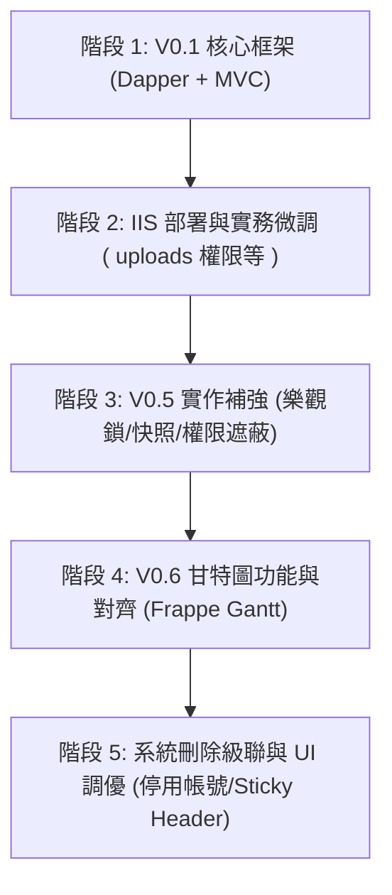

# MPMS 多專案管理系統 (Multi-Project Management System)
# 整合系統設計與開發演進規格書

本文件整合了 MPMS 系統從最初規劃（V0.1）至最新版本（V0.6）的開發歷程與系統設計。系統設計的核心目標是協助專案經理（PM）、一般開發人員（Employee）與系統管理員（Admin）進行跨專案的進度追蹤、週會控管、任務同儕審查、檔案遮蔽安全稽核與即時通知同步。

---

## 一、 使用者需求 (Prompt) 演進軌跡與功能對應

我們將 200 次的對話與 Prompt 整理，歸納出系統發展的五大核心演進階段：



### 1. 核心骨架與資料庫建置（Prompt #1 ~ #35）
* **核心需求**：依據 V0.1 規格書建立 ASP.NET Core MVC 專案，設計基礎 Roles（Admin/PM/Employee）、資料庫 Seed，實作 Cookie 登入、個人工作台、專案與任務 CRUD。
* **技術點**：Dapper Repository 模式、本地 SQL Server 連線設定（採用 Windows 驗證）。

### 2. 環境部署與實地驗證（Prompt #36 ~ #108）
* **核心需求**：將系統發佈（Publish）部署至本機 IIS，解決連接埠衝突、`uploads/` 目錄權限拒絕、IIS ApplicationPool 與 SQL Server 驗證問題（使用特定使用者 `mpms_user`）。
* **配置優化**：增加 GitHub .gitignore、引入 Codespaces 架構（`.devcontainer`）並於 `README.md` 置入一鍵啟動按鈕。

### 3. V0.5 進階安全與高階管理（Prompt #109 ~ #130）
* **核心需求**：
  * **並發控制**：任務與審查引入 `row_version` (樂觀鎖)，解決多視窗操作衝突。
  * **週進度快照**：支援週別 version 遞增封存，舊版本設為非 current，保留修訂原因。
  * **檔案遮蔽保護**：附件增設 Public/ProjectMember/Masked 等級。一般人員看 Masked 檔名顯示 `***` 且阻擋下載；引入背景 `VirusScanJob`（10秒掃描一次，Passed 後才開放下載）。

### 4. V0.6 前端甘特圖大升級（Prompt #131 ~ #179）
* **核心需求**：
  * **排列結構**：甘特圖依「專案階段 -> 任務」層次排列（而非分區顯示）。
  * **資訊顯示**：支援任務天數計算、主辦人/期間/天數的前端動態勾選過濾。
  * **滑鼠懸停 tooltip**：滑鼠移入顯示任務摘要，點擊橫條可直接導向任務詳情頁面。
  * **雙向滾動對齊**：固定左側任務名稱 table，與右側 SVG 長條圖進行垂直滾動同步。

### 5. 級聯刪除與刪除友善化（Prompt #180 ~ #200）
* **核心需求**：
  * **級聯刪除 (Cascade)**：刪除專案/階段/任務/週會時，自動清理其依賴的所有外鍵記錄（如週會快照級聯清除、Action Item 清除）。
  * **帳號防呆**：因應稽核歷史，將使用者「刪除」改為「啟用/停用」狀態切換。
  * **錯誤提示翻譯**：實作 `DbErrorTranslationHelper`，將資料庫外鍵約束報錯（例如 `FK_MPMS_WEEKLY_SNAPSHOT_PARENT`）翻譯為一般人看得懂的繁體中文。
  * **Gantt Sticky Header**：固定甘特圖時間軸表頭。將 header 元素附在 SVG 根節點最尾端，使其層級在最上層，阻止進度條在向上滾動時覆蓋月份標籤。

---

## 二、 系統架構設計

系統採用傳統的三層式架構（3-Tier Architecture），強調低耦合與高效能：

```
┌────────────────────────────────────────────────────────┐
│                      Presentation                      │
│             ASP.NET Core MVC (Views & Razor)           │
├────────────────────────────────────────────────────────┤
│                     Business Logic                     │
│    AuthService  |  NotificationService  | AuditService │
├────────────────────────────────────────────────────────┤
│                       Data Access                      │
│           Dapper Repositories (BaseRepository)         │
└────────────────────────────────────────────────────────┘
```

1. **Web 框架**：ASP.NET Core MVC (.NET 9.0)，以 Kestrel 作為邊緣伺服器，或在 IIS 下以 `AspNetCoreModuleV2` 進行反向代理。
2. **ORM**：**Dapper**，直接編寫高效 SQL 查詢，配合 `Dapper.DefaultTypeMap.MatchNamesWithUnderscores = true` 實現資料庫 `snake_case` 與模型 `PascalCase` 屬性之映射。
3. **資料庫**：SQL Server，採用樂觀並發控制、預防環狀相依檢查等交易機制。
4. **即時同步**：**SignalR**。當任務狀態更新或會議封存時，通知所有已連線之週會主控台、通知鈴鐺非同步重整。
5. **背景排程**：**Quartz.NET**，用以發送每日逾期郵件與非同步模擬 SMTP 發送（`MPMS_EMAIL_LOG`）。
6. **附件儲存**：在 `IAttachmentStorageService` 下實現 `LocalAttachmentStorageService`（本機儲存）以適應無 Azure 帳戶之私有部署環境。

---

## 三、 資料庫結構設計 (Database Schema)

資料庫主要資料表結構與關聯關係如下：

### 1. 主要實體表 (Core Entities)
* **`dbo.MPMS_ROLE`**：儲存角色（`ADMIN`、`PM`、`EMPLOYEE`）。
* **`dbo.MPMS_USER`**：使用者帳號（加密密碼雜湊採用 BCrypt 演算法，含 `is_active` 控制停用/啟用）。
* **`dbo.MPMS_PROJECT`**：專案主檔（PM 負責人、起訖日期、進度）。
* **`dbo.MPMS_PROJECT_PHASE`** (於 V0.6 引入，對應原里程碑之擴充)：代表專案階段，含 `sort_no` 排序。
* **`dbo.MPMS_TASK`**：任務主檔，含 `row_version` (樂觀鎖欄位)、`reviewer_user_id` 與 `backup_reviewer_user_id` 等多輪審查人定義。
* **`dbo.MPMS_TASK_ASSIST`**：任務協辦人關聯表，設有 Trigger 防止將負責人重複設為協辦人。
* **`dbo.MPMS_TASK_DEPENDENCY`** (V0.6 引入)：相依任務關係表，預防任務間形成循環相依。

### 2. 審查、附件與日誌表 (Reviews, Attachments & Logs)
* **`dbo.MPMS_TASK_ATTACHMENT`**：任務附件記錄，含 `visibility_type` (權限遮蔽) 與 `scan_status` (病毒檢測狀態)。
* **`dbo.MPMS_TASK_REVIEW`**：審查歷程記錄，含審查意見、審查結果與來源類型（`PeerReview`、`MeetingReturn`、`AdminOverride`）。
* **`dbo.MPMS_TASK_STATUS_LOG`**：任務狀態生命週期異動日誌。
* **`dbo.MPMS_AUDIT_LOG`**：系統稽核日誌，記錄管理者或 PM 之高風險操作前後數值 (JSON 格式)。

### 3. 週會與快照 (Meetings & Snapshots)
* **`dbo.MPMS_MEETING`**：週會紀錄主檔，關聯 `meeting_week` (格式 YYYY-WW)。
* **`dbo.MPMS_MEETING_ACTION`**：週會臨時派工項目 (Action Item)，可直接在後台以 Transaction 轉為專案正式任務。
* **`dbo.MPMS_WEEKLY_SNAPSHOT`**：週快照主記錄，含版本號、當前最新版本旗標 (`is_current_version`) 與修訂原因。
* **`dbo.MPMS_SNAPSHOT_PROJECT` / `_PHASE` / `_TASK`**：快照副表，用以在封存當下使用 `INSERT INTO ... SELECT` 將相關專案、階段、任務進度凍結存檔。

---

## 四、 關鍵特色功能設計

### 1. 前置相依性循環相依偵測 (DFS 圖形演算法)
* 為了防止任務 A 依賴 B，B 依賴 C，C 又回頭依賴 A 的死鎖現象，系統在寫入前置相依性時，會呼叫 `CheckHasCycleAsync` 進行深度優先搜索 (Depth-First Search, DFS) 圖形走訪：
```csharp
// 偽程式碼邏輯
public async Task<bool> CheckHasCycleAsync(int taskId, List<int> newPredecessors)
{
    // 1. 載入當前專案下所有任務的相依邊
    // 2. 將即將更新的相依邊加入圖中
    // 3. 執行 DFS，維護 visited 與 recStack 狀態
    // 4. 若發現 recStack 中有重複拜訪之節點，表示有環 (Cycle)
}
```
* **前端整合**：若偵測到環，資料庫交易回滾，並向前端輸出「前置任務設定會產生循環相依！」之中文友善警示。

### 2. 週進度快照修正版控制
* 週會進度需要高防真備份，系統採「唯讀修正版遞增」設計。
* 若 PM 重新封存某一週的快照，系統不會覆蓋原資料，而是自動查詢該週最大版本，並新增一筆 `version = max + 1` 的紀錄，同時將舊版 `is_current_version` 更新為 `0`，新版更新為 `1`。這保證了歷史進度趨勢圖（Chart.js）可以精準還原每一週的資料演進軌跡。

### 3. 敏感附件權限與遮蔽機制 (Security Shield)
* 完佐附件有 `visibility_type` 設定：
  * **機密 (ProjectMember)** 或 **遮蔽 (Masked)**：在下載端點限制，僅允許 PM、Admin、主/協辦人與指派的審查人下載（返回 403）。
  * **遮蔽 (Masked) 處理**：一般非專案人員進入任務細節頁面，遮蔽檔案的檔名與摘要將會由後台直接轉換為 `***` 遮蔽字串，且前端不會渲染下載按鈕，在資料層即確保隱私安全性。

### 4. 甘特圖雙向滾動對齊與 Sticky Header (Z-Index 固定)
* **左表與右圖同步**：左側任務列表與右側 SVG 長條圖為獨立容器。當左側垂直滾動時，更新右側 `scrollTop`；反之亦然。
* **Sticky Timeline Header**：由於 SVG 不支援 CSS `z-index`，我們利用 JavaScript 在監聽到 scroll 事件時，將時間軸的表頭元素 (`headerRect`, `upperTexts`, `lowerTexts`) 動態 `appendChild` 至根 `<svg>` 節點的最後面。
* 這保證了這些表頭元素在 DOM 繪製順序中排行最後，因此在畫面上絕對會疊在所有進度長条圖的最前方。所有進度條向上滾動時，都會完美滑入時間軸背景之下並被遮蔽。
